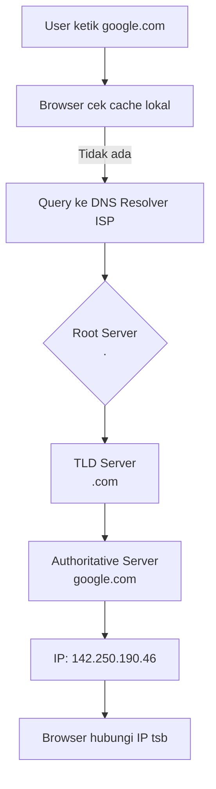

## MODUL PEMBELAJARAN: DASAR JARINGAN KOMPUTER & ALAMAT IP  
*Dirancang untuk Pemula dengan Analogi Kehidupan Nyata*

---

### TUJUAN PEMBELAJARAN
Setelah mempelajari modul ini, siswa mampu:
1. Menjelaskan arsitektur client-server dan perannya dalam komunikasi jaringan
2. Memahami fungsi NIC sebagai "gerbang fisik" koneksi jaringan
3. Mengidentifikasi struktur IP Address (Network ID & Host ID)
4. Menghitung Netmask, Network ID, Broadcast Address, dan rentang Host
5. Menjelaskan peran DNS sebagai penerjemah nama domain ke alamat IP
6. Menerapkan konsep subnetting pada skenario jaringan nyata

---

### PETA KONSEP
```
JARINGAN KOMPUTER
│
├── HARDWARE: NIC → Kabel/WiFi → Switch/Router
│
├── IDENTITAS: IP Address + Netmask → Network ID & Host ID
│
├── KOMUNIKASI: Client ↔ Server (Request-Response)
│
└── RESOLUSI: DNS → Terjemahkan Nama ↔ IP
```

---

## 1. NIC (NETWORK INTERFACE CARD): GERBANG FISIK JARINGAN

### Definisi Ilmiah
Komponen hardware yang memungkinkan perangkat terhubung ke jaringan fisik (kabel/wireless). Setiap NIC memiliki **MAC Address** unik 48-bit (format `XX:XX:XX:XX:XX:XX`) yang ditanam pabrikan.

### Fungsi Utama
| Fungsi               | Penjelasan                                             |
| -------------------- | ------------------------------------------------------ |
| **Enkapsulasi Data** | Mengubah data komputer menjadi sinyal elektrik/optik   |
| **Filtering**        | Hanya menerima paket yang ditujukan ke MAC Address-nya |
| **Buffering**        | Menyimpan sementara data sebelum dikirim/diproses      |

### Analogi Sederhana
> **NIC = Kartu SIM + Antena HP**  
> Tanpa SIM (NIC), HP (komputer) tidak bisa terhubung ke jaringan operator (internet). MAC Address = nomor IMEI yang unik untuk setiap perangkat.

### Jenis NIC Modern
| Jenis        | Contoh                    | Kecepatan           |
| ------------ | ------------------------- | ------------------- |
| **Ethernet** | Port RJ-45 di laptop      | 100 Mbps – 10 Gbps  |
| **Wi-Fi**    | Adapter wireless internal | 150 Mbps – 2.4 Gbps |
| **Virtual**  | vNIC di Docker/VM         | Bergantung host     |

> 💡 **Fakta Penting:** IP Address bisa berubah (dynamic), tapi MAC Address bersifat permanen (kecuali di-spoofing).

---

## 2. ARSITEKTUR CLIENT-SERVER

### Definisi Ilmiah
Model komunikasi terdistribusi di mana **client** (peminta layanan) mengirim *request* ke **server** (penyedia layanan) yang memiliki sumber daya terpusat.

### Perbandingan Peran
| Komponen   | Karakteristik                                                | Contoh Nyata                |
| ---------- | ------------------------------------------------------------ | --------------------------- |
| **Client** | • Spesifikasi rendah<br>• Inisiatif koneksi<br>• Session-based | Laptop, HP, Browser         |
| **Server** | • Spesifikasi tinggi<br>• Selalu online<br>• Multi-user      | Web server, Database server |

### Analogi Restoran
```
Client = Pelanggan → "Saya mau nasi goreng!" (Request)
        ↓
Server = Dapur + Pelayan → Memasak & mengantarkan (Response)
        ↓
Client = Pelanggan → Menerima makanan (Data diterima)
```

### ⚠️ Perbedaan dengan Peer-to-Peer (P2P)
- **Client-Server:** Ada hierarki (server otoritatif)
- **P2P:** Semua node setara (contoh: torrent, WhatsApp Web)

---

## 3. IP ADDRESS: IDENTITAS DIGITAL PERANGKAT

### Struktur IPv4 (32-bit)
```
192 . 168 . 1 . 10
 ↑     ↑    ↑   ↑
Oktet 1  2  3  4 → Setiap oktet = 8 bit (0-255)
```

### Komponen Penting
| Bagian         | Fungsi                                    | Analogi     |
| -------------- | ----------------------------------------- | ----------- |
| **Network ID** | Mengidentifikasi jaringan/grup            | Nomor RT/RW |
| **Host ID**    | Mengidentifikasi perangkat dalam jaringan | Nomor rumah |

### Contoh Pembagian Berdasarkan Kelas (Historis)
| Kelas | Format Network ID | Contoh IP    | Host Maks |
| ----- | ----------------- | ------------ | --------- |
| A     | `N.H.H.H`         | 10.0.0.5     | 16 juta   |
| B     | `N.N.H.H`         | 172.16.2.8   | 65 ribu   |
| C     | `N.N.N.H`         | 192.168.1.10 | 254       |

> 🔸 **Catatan:** Kelas IP sudah jarang dipakai; modern menggunakan **CIDR** (Classless Inter-Domain Routing).

---

## 4. NETMASK & SUBNETTING: MEMBAGI JARINGAN MENJADI SUB-JARINGAN

### Definisi Ilmiah
Netmask adalah pola bit yang memisahkan bagian **Network ID** dan **Host ID** pada IP Address melalui operasi logika **AND**.

### Format CIDR → Netmask
| Prefix | Biner                                 | Desimal         | Jumlah Host |
| ------ | ------------------------------------- | --------------- | ----------- |
| `/24`  | `11111111.11111111.11111111.00000000` | 255.255.255.0   | 254         |
| `/25`  | `11111111.11111111.11111111.10000000` | 255.255.255.128 | 126         |
| `/26`  | `11111111.11111111.11111111.11000000` | 255.255.255.192 | 62          |

### Cara Cepat Menghitung (Tanpa Kalkulator)
**Contoh:** IP `192.168.10.45/26`

1. **Tentukan blok subnet:**  
   `/26` → 26 bit network → sisa 6 bit host → `2⁶ = 64` (ukuran blok)

2. **Cari Network ID:**  
   Kelipatan 64 yang ≤ 45 → **0**  
   → Network ID = `192.168.10.0`

3. **Cari Broadcast:**  
   Network ID + ukuran blok - 1 → `0 + 64 - 1 = 63`  
   → Broadcast = `192.168.10.63`

4. **Rentang Host Valid:**  
   `192.168.10.1` sampai `192.168.10.62` (total 62 host)

---

## 5. BROADCAST ADDRESS: PANGGILAN KE SELURUH JARINGAN

### Definisi
Alamat khusus untuk mengirim paket ke **semua host** dalam satu subnet. Dibuat dengan mengubah seluruh bit Host ID menjadi `1`.

### Contoh Visualisasi
```
IP:        192.168.1.10   → 11000000.10101000.00000001.00001010
Netmask:   255.255.255.0  → 11111111.11111111.11111111.00000000
---------------------------------------------------------------
Network ID:192.168.1.0    → 11000000.10101000.00000001.00000000
Broadcast: 192.168.1.255  → 11000000.10101000.00000001.11111111
```

### Penggunaan Nyata
- DHCP Discover (mencari server DHCP)
- ARP Request (mencari MAC Address dari IP)
- Wake-on-LAN (menyalakan komputer jarak jauh)

##  6. DNS (DOMAIN NAME SYSTEM): BUKU TELEPON INTERNET

### Cara Kerja DNS Resolution


### Jenis Record DNS Penting
| Record    | Fungsi        | Contoh                          |
| --------- | ------------- | ------------------------------- |
| **A**     | Domain → IPv4 | `google.com → 142.250.190.46`   |
| **AAAA**  | Domain → IPv6 | `google.com → 2a00:1450:400...` |
| **CNAME** | Alias domain  | `www.google.com → google.com`   |
| **MX**    | Server email  | `mail.google.com`               |

### Perintah Diagnostik
```bash
# Cek IP dari domain
nslookup google.com

# Trace jalur DNS resolution
dig google.com +trace

# Flush cache DNS (Windows)
ipconfig /flushdns
```

---

## 🧪 AKTIVITAS PRAKTIKUM (Hands-On)

### Praktikum 1: Identifikasi NIC & Konfigurasi IP
```bash
# Linux/macOS
ip addr show          # Lihat semua NIC & IP
ip link show eth0     # Detail NIC spesifik

# Windows
ipconfig /all         # Lihat IP, MAC, DNS
getmac                # Lihat MAC Address semua NIC
```

### Praktikum 2: Uji Komunikasi Jaringan
```bash
# 1. Cek koneksi ke gateway/router
ping 192.168.1.1

# 2. Uji komunikasi ke host se-subnet
ping 192.168.1.20     # Pastikan Network ID sama!

# 3. Uji resolusi DNS
nslookup facebook.com
curl -v https://157.240.22.35  # Buka via IP (tanpa DNS)
```

### Praktikum 3: Subnetting Manual
**Kasus:** Perusahaan butuh 3 subnet dari `192.168.10.0/24` dengan kebutuhan:
- Subnet A: 50 host (kantor pusat)
- Subnet B: 30 host (cabang)
- Subnet C: 10 host (IoT)

**Tugas:** Hitung Network ID, Broadcast, dan rentang host untuk tiap subnet!

---

##  RINGKASAN KONSEP PENTING

| Konsep         | Kunci Pemahaman                                       |
| -------------- | ----------------------------------------------------- |
| **NIC**        | Gerbang fisik jaringan; punya MAC Address permanen    |
| **IP Address** | Alamat logis 32-bit; terbagi Network ID + Host ID     |
| **Netmask**    | "Pagar digital" yang batasi ruang lingkup jaringan    |
| **Subnetting** | Teknik hemat IP dengan bagi jaringan besar jadi kecil |
| **Broadcast**  | Alamat khusus untuk panggil semua host dalam subnet   |
| **DNS**        | Sistem terdistribusi yang terjemahkan nama → IP       |

---

## EVALUASI PEMAHAMAN (Contoh Soal)

1. **Pertanyaan Konseptual:**  
   Mengapa komputer butuh NIC meskipun sudah punya IP Address?

2. **Perhitungan Subnetting:**  
   Diketahui IP `172.16.5.45/27`. Hitung:  
   a) Netmask desimal  
   b) Network ID  
   c) Broadcast Address  
   d) Jumlah host valid

3. **Studi Kasus:**  
   Dua laptop dengan IP `192.168.1.10/24` dan `192.168.1.20/25` tidak bisa saling ping. Jelaskan penyebabnya!

